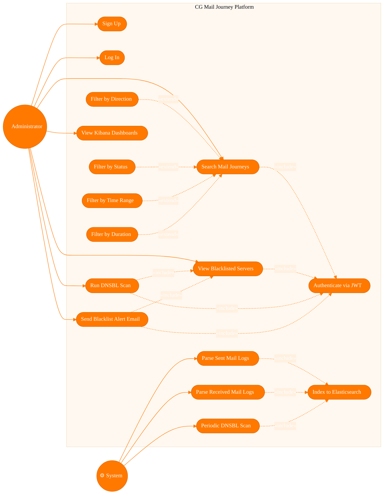
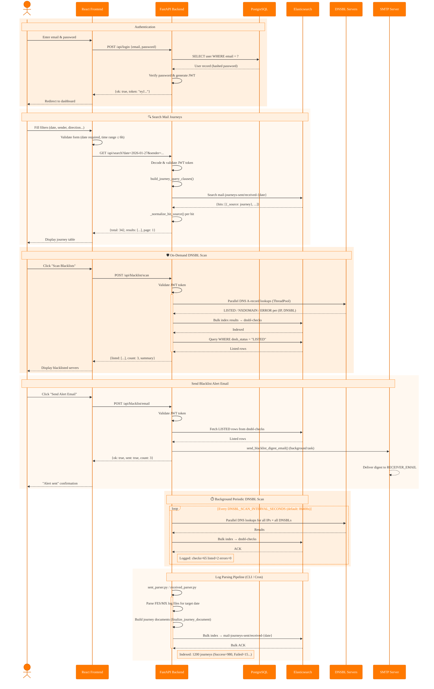

# CG Mail Journey -- UML Diagrams

---

## 1. Use Case Diagram (Mermaid)

---

## 2. Sequence Diagram (Mermaid)

---

## 3. Use Case Diagram -- Detailed Description

### Canvas & Theme

- **Background**: white (`#FFFFFF`)
- **Primary accent color**: Orange brand orange `#FF7900`
- **Secondary fill**: light peach `#FFF0E0`
- **Border color**: darker orange `#E56A00`
- **Font**: Segoe UI or Arial, 13-14px, dark gray `#333333`
- **Layout direction**: left-to-right (actors on the sides, system boundary in the center)

### System Boundary

- A large rounded rectangle in the center of the canvas
- **Border**: 2px solid `#FF7900`
- **Fill**: very light orange `#FFF8F0`
- **Title** at the top center, inside the rectangle: **"CG Mail Journey Platform"** in bold, 16px, color `#FF7900`, preceded by an orange diamond icon (🔶)

### Actors (stick figures or circled icons)

| Actor | Position | Icon | Label |
|---|---|---|---|
| **Administrator** | Left side, vertically centered | 👤 stick figure | "Administrator" below the figure |
| **System** | Right side, vertically centered | ⚙️ gear icon | "System" below the figure |

- Actor circles: fill `#FF7900`, text `#FFFFFF`, border `#E56A00`, 2px stroke

### Use Cases (ovals/ellipses inside the system boundary)

Arranged in a vertical stack inside the system rectangle, split into 3 columns:

**Left column (Administrator's primary use cases):**

| # | Label | Fill | Border |
|---|---|---|---|
| UC1 | Sign Up | `#FFF0E0` | `#FF7900` |
| UC2 | Log In | `#FFF0E0` | `#FF7900` |
| UC3 | Search Mail Journeys | `#FFF0E0` | `#FF7900` |
| UC4 | View Blacklisted Servers | `#FFF0E0` | `#FF7900` |
| UC5 | Run DNSBL Scan | `#FFF0E0` | `#FF7900` |
| UC6 | Send Blacklist Alert Email | `#FFF0E0` | `#FF7900` |
| UC9 | View Kibana Dashboards | `#FFF0E0` | `#FF7900` |

**Center column (shared/included use cases):**

| # | Label | Fill | Border |
|---|---|---|---|
| UC10 | Authenticate via JWT | `#FFE0C2` | `#E56A00` |
| UC16 | Index to Elasticsearch | `#FFE0C2` | `#E56A00` |

**Right column (System's use cases + extend use cases):**

| # | Label | Fill | Border |
|---|---|---|---|
| UC7 | Parse Sent Mail Logs | `#FFF0E0` | `#FF7900` |
| UC8 | Parse Received Mail Logs | `#FFF0E0` | `#FF7900` |
| UC15 | Periodic DNSBL Scan | `#FFF0E0` | `#FF7900` |
| UC11 | Filter by Direction | `#FFF8F0` | `#FFAA55` |
| UC12 | Filter by Status | `#FFF8F0` | `#FFAA55` |
| UC13 | Filter by Time Range | `#FFF8F0` | `#FFAA55` |
| UC14 | Filter by Duration | `#FFF8F0` | `#FFAA55` |

- Every use case is an **ellipse** (horizontal oval), 2px border, text centered inside in dark gray `#333333`, 13px
- The extend use cases (UC11-14) have a slightly lighter fill and lighter border to visually distinguish them

### Connections

**Actor → Use Case (solid lines):**

- Style: **solid line**, 2px, color `#FF7900`, no arrowhead (or simple line ending)
- Administrator connects to: UC1, UC2, UC3, UC4, UC5, UC6, UC9 (7 lines)
- System connects to: UC7, UC8, UC15 (3 lines)

**«include» relationships (dashed arrows):**

- Style: **dashed line** (dash pattern: 6px dash, 4px gap), 1.5px, color `#E56A00`, **open arrowhead** pointing toward the included use case
- Label: **«include»** in italic, 11px, color `#E56A00`, placed at midpoint of the line

| From (base) | To (included) |
|---|---|
| UC3 (Search Mail Journeys) | → UC10 (Authenticate via JWT) |
| UC4 (View Blacklisted Servers) | → UC10 (Authenticate via JWT) |
| UC5 (Run DNSBL Scan) | → UC10 (Authenticate via JWT) |
| UC6 (Send Blacklist Alert Email) | → UC10 (Authenticate via JWT) |
| UC5 (Run DNSBL Scan) | → UC4 (View Blacklisted Servers) |
| UC6 (Send Blacklist Alert Email) | → UC4 (View Blacklisted Servers) |
| UC7 (Parse Sent Mail Logs) | → UC16 (Index to Elasticsearch) |
| UC8 (Parse Received Mail Logs) | → UC16 (Index to Elasticsearch) |
| UC15 (Periodic DNSBL Scan) | → UC16 (Index to Elasticsearch) |

**«extend» relationships (dashed arrows):**

- Style: **dashed line** (same pattern as include), 1.5px, color `#FFAA55`, **open arrowhead** pointing toward the **base** use case (the one being extended)
- Label: **«extend»** in italic, 11px, color `#FFAA55`

| From (extending) | To (base) |
|---|---|
| UC11 (Filter by Direction) | → UC3 (Search Mail Journeys) |
| UC12 (Filter by Status) | → UC3 (Search Mail Journeys) |
| UC13 (Filter by Time Range) | → UC3 (Search Mail Journeys) |
| UC14 (Filter by Duration) | → UC3 (Search Mail Journeys) |

---

## 4. Sequence Diagram -- Detailed Description

### Canvas & Theme

- **Background**: white `#FFFFFF`
- **Lifeline color**: dashed vertical line, 1.5px, color `#CCCCCC`
- **Activation box** (when a participant is active): fill `#FFF0E0`, border `#FF7900`, 1.5px
- **Message arrows**: solid `#333333` for synchronous calls, dashed `#333333` for return/response
- **Font**: Segoe UI or Arial, 13px, `#333333`

### Participants (left to right)

| Position | Name | Short Label | Header Box Fill | Header Text Color | Header Border |
|---|---|---|---|---|---|
| 1 | Administrator | 👤 Administrator | `#FF7900` | `#FFFFFF` | `#E56A00` |
| 2 | React Frontend | FE | `#FF7900` | `#FFFFFF` | `#E56A00` |
| 3 | FastAPI Backend | API | `#FF7900` | `#FFFFFF` | `#E56A00` |
| 4 | PostgreSQL | PG | `#FF7900` | `#FFFFFF` | `#E56A00` |
| 5 | Elasticsearch | ES | `#FF7900` | `#FFFFFF` | `#E56A00` |
| 6 | DNSBL Servers | DNS | `#FF7900` | `#FFFFFF` | `#E56A00` |
| 7 | SMTP Server | SMTP | `#FF7900` | `#FFFFFF` | `#E56A00` |

- Participant 1 (Administrator) is rendered as an **actor stick figure** (not a box)
- Participants 2-7 are rendered as **rectangles** with the label inside

### Interaction Blocks

Each block is wrapped in a colored **rect** (rounded rectangle background behind the messages). A **Note** bar spans across the relevant lifelines as a section title.

---

#### Block 1: Authentication

- **Rect background**: `rgb(255, 240, 224)` / `#FFF0E0`
- **Note bar**: spans from Administrator to PostgreSQL, text: "🔐 Authentication", fill `#FFF0E0`, border `#FF7900`

| # | From | Arrow | To | Message label |
|---|---|---|---|---|
| 1 | Administrator | ──▶ solid | FE | Enter email & password |
| 2 | FE | ──▶ solid | API | POST /api/login {email, password} |
| 3 | API | ──▶ solid | PG | SELECT user WHERE email = ? |
| 4 | PG | ──▷ dashed return | API | User record (hashed password) |
| 5 | API | ──▶ self-call | API | Verify password & generate JWT |
| 6 | API | ──▷ dashed return | FE | {ok: true, token: "eyJ..."} |
| 7 | FE | ──▷ dashed return | Administrator | Redirect to dashboard |

---

#### Block 2: Search Mail Journeys

- **Rect background**: `rgb(255, 248, 240)` / `#FFF8F0`
- **Note bar**: spans Administrator to Elasticsearch, text: "🔍 Search Mail Journeys"

| # | From | Arrow | To | Message label |
|---|---|---|---|---|
| 1 | Administrator | ──▶ solid | FE | Fill filters (date, sender, direction...) |
| 2 | FE | ──▶ self-call | FE | Validate form (date required, time range ≤ 6h) |
| 3 | FE | ──▶ solid | API | GET /api/search?date=2026-01-27&sender=... |
| 4 | API | ──▶ self-call | API | Decode & validate JWT token |
| 5 | API | ──▶ self-call | API | build_journey_query_clauses() |
| 6 | API | ──▶ solid | ES | Search mail-journeys-sent/received-{date} |
| 7 | ES | ──▷ dashed return | API | {hits: [{_source: journey}, ...]} |
| 8 | API | ──▶ self-call | API | _normalize_hit_source() per hit |
| 9 | API | ──▷ dashed return | FE | {total: 342, results: [...], page: 1} |
| 10 | FE | ──▷ dashed return | Administrator | Display journey table |

---

#### Block 3: On-Demand DNSBL Scan

- **Rect background**: `rgb(255, 240, 224)` / `#FFF0E0`
- **Note bar**: spans Administrator to DNSBL Servers, text: "🛡️ On-Demand DNSBL Scan"
- API lifeline has an **activation bar** for the entire scan duration

| # | From | Arrow | To | Message label |
|---|---|---|---|---|
| 1 | Administrator | ──▶ solid | FE | Click "Scan Blacklists" |
| 2 | FE | ──▶ solid | API | POST /api/blacklist/scan |
| 3 | API | ──▶ self-call | API | Validate JWT token |
| 4 | API | ──▶ solid | DNS | Parallel DNS A-record lookups (ThreadPool) |
| 5 | DNS | ──▷ dashed return | API | LISTED / NXDOMAIN / ERROR per (IP, DNSBL) |
| 6 | API | ──▶ solid | ES | Bulk index results → dnsbl-checks |
| 7 | ES | ──▷ dashed return | API | Bulk ACK |
| 8 | API | ──▶ solid | ES | Query WHERE dnsb_status = "LISTED" |
| 9 | ES | ──▷ dashed return | API | Listed rows |
| 10 | API | ──▷ dashed return | FE | {listed: [...], count: 3, summary} |
| 11 | FE | ──▷ dashed return | Administrator | Display blacklisted servers |

---

#### Block 4: Send Blacklist Alert Email

- **Rect background**: `rgb(255, 248, 240)` / `#FFF8F0`
- **Note bar**: spans Administrator to SMTP Server, text: "📧 Send Blacklist Alert Email"

| # | From | Arrow | To | Message label |
|---|---|---|---|---|
| 1 | Administrator | ──▶ solid | FE | Click "Send Alert Email" |
| 2 | FE | ──▶ solid | API | POST /api/blacklist/email |
| 3 | API | ──▶ self-call | API | Validate JWT token |
| 4 | API | ──▶ solid | ES | Fetch LISTED rows from dnsbl-checks |
| 5 | ES | ──▷ dashed return | API | Listed rows |
| 6 | API | ──▶ solid | SMTP | send_blacklist_digest_email() (background task) |
| 7 | API | ──▷ dashed return | FE | {ok: true, sent: true, count: 3} |
| 8 | SMTP | ──▶ self-call | SMTP | Deliver digest to RECEIVER_EMAIL |
| 9 | FE | ──▷ dashed return | Administrator | "Alert sent" confirmation |

---

#### Block 5: Background Periodic DNSBL Scan

- **Rect background**: `rgb(255, 240, 224)` / `#FFF0E0`
- **Note bar**: spans API to Elasticsearch, text: "⏱️ Background Periodic DNSBL Scan"
- Wrapped in a **loop** frame labeled: "Every DNSBL_SCAN_INTERVAL_SECONDS (default: 86400s)"
- Loop frame border: `#FF7900`, label color: `#FF7900`

| # | From | Arrow | To | Message label |
|---|---|---|---|---|
| 1 | API | ──▶ solid | DNS | Parallel DNS lookups for all IPs × all DNSBLs |
| 2 | DNS | ──▷ dashed return | API | Results |
| 3 | API | ──▶ solid | ES | Bulk index → dnsbl-checks |
| 4 | ES | ──▷ dashed return | API | ACK |
| — | (Note right of API) | | | "Logged: checks=65 listed=2 errors=0" |

---

#### Block 6: Log Parsing Pipeline

- **Rect background**: `rgb(255, 248, 240)` / `#FFF8F0`
- **Note bar**: spans API to Elasticsearch, text: "📂 Log Parsing Pipeline (CLI / Cron)"
- API lifeline has an **activation bar**

| # | From | Arrow | To | Message label |
|---|---|---|---|---|
| 1 | API | ──▶ self-call | API | sent_parser.py / received_parser.py |
| 2 | API | ──▶ self-call | API | Parse FES/MX log files for target date |
| 3 | API | ──▶ self-call | API | Build journey documents (finalize_journey_document) |
| 4 | API | ──▶ solid | ES | Bulk index → mail-journeys-sent/received-{date} |
| 5 | ES | ──▷ dashed return | API | Bulk ACK |
| — | (Note right of API) | | | "Indexed: 1200 journeys (Success=980, Failed=15...)" |

---

### Arrow Legend (applies to all blocks)

| Style | Meaning |
|---|---|
| **──▶** solid line, filled arrowhead | Synchronous call / request |
| **──▷** dashed line, open arrowhead | Return / response |
| **──▶ self-loop** (arrow curving back to same lifeline) | Internal processing / self-call |
| **Dashed vertical line** below each participant | Lifeline |
| **Narrow orange rectangle** on a lifeline | Activation (participant is processing) |
